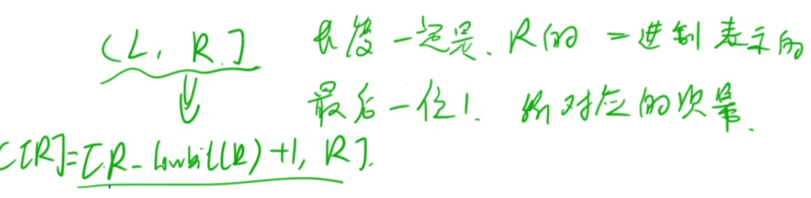
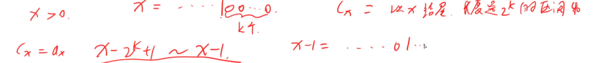
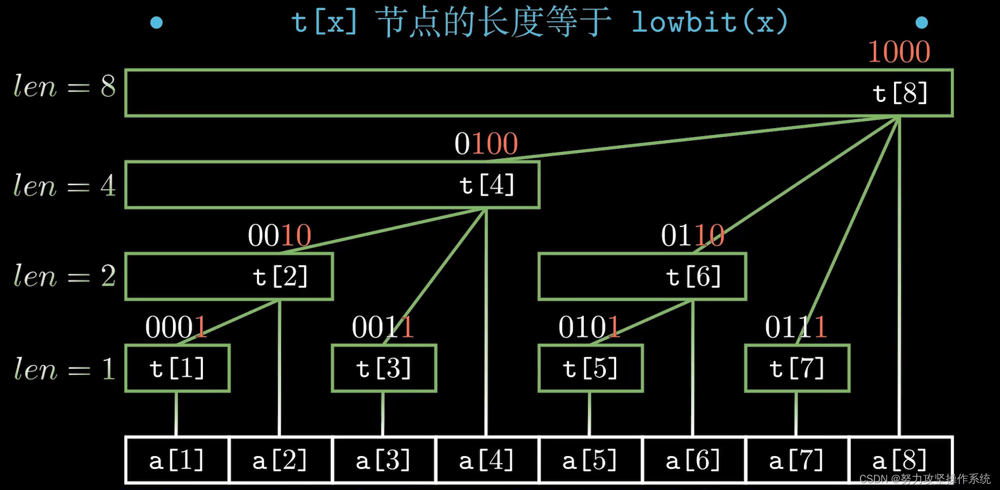
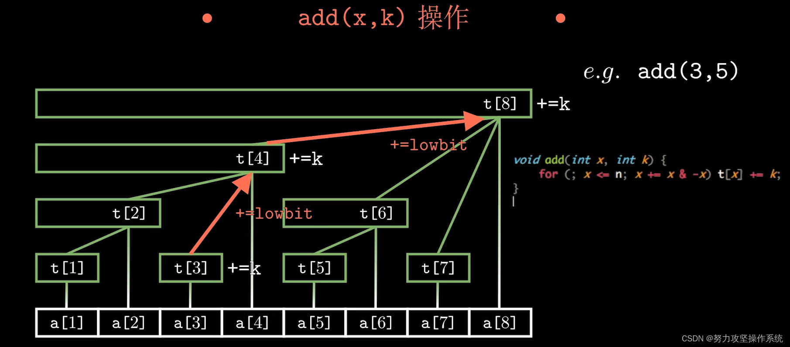
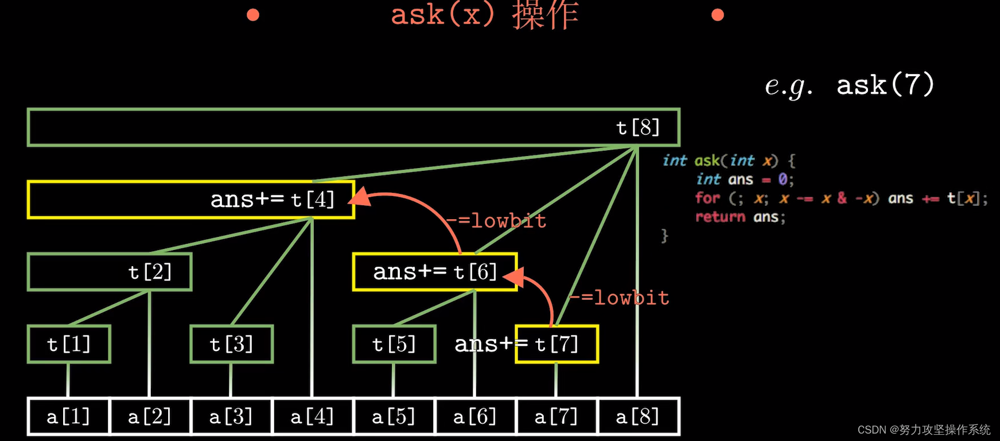
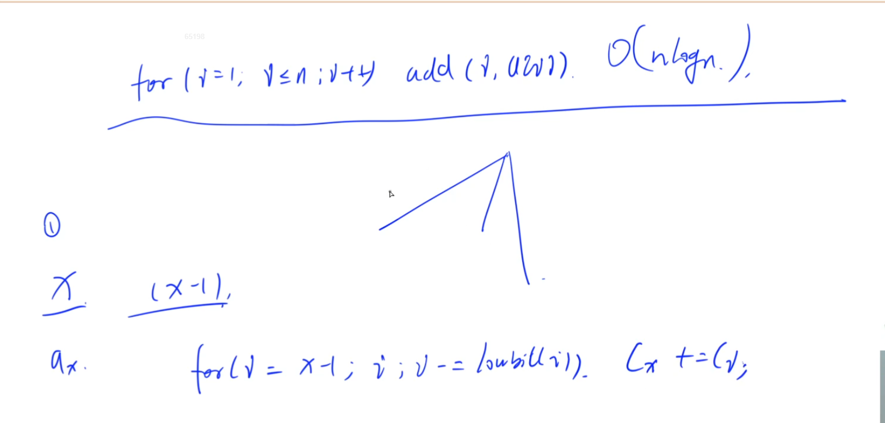

## 树状数组
给出一个长度为n的数组，完成以下两种操作多次：1、将下标为index的元素的值加上k（k可以是正数也可以是负数） 2、输出区间[left, right]内所有元素的和（包含边界）

朴素算法：对区间的元素累加求和，复杂度O(n^2)，单点修改复杂度O(1)，区间查询复杂度O(n)

前缀和：复杂度O(n^2)，单点修改复杂度O(n)，因为修改完数组值后还要修改前缀树组的值，区间查询复杂度O(1)

可以看出以上两种方法时间复杂度都比较高，而用树状数组可以有效的降低时间复杂度。

树状数组：树状数组或二叉索引树（英语：Binary Indexed Tree），又以其发明者命名为Fenwick树，最早由Peter M. Fenwick于1994年以A New Data Structure for Cumulative Frequency Tables为题发表在SOFTWARE PRACTICE AND EXPERIENCE。其初衷是解决数据压缩里的累积频率（Cumulative Frequency）的计算问题，现多用于高效计算数列的前缀和， 区间和。（复杂度O(nlogn)，单点修改复杂度O(logn)，区间查询复杂度O(logn)）.
前置知识：lowbit函数

lowbit函数即求一个非负整数在二进制表示下最低位1和后面的0所构成的十进制值。如lowbit(18) = 2（18的二进制表示为0b10010， 0b10的十进制值为2），lowbit(32) = 32（32的二进制表示为0b100000，0b100000的十进制值为32）......

lowbit的实现方法有两种：

1、消去最后一位的1然后再用原数字减去消去最后一位1的数。

~~~
int lowbit(int n){
    return n - (n & (n - 1));
}
 
/*
因为非负整数数n可以表示为x100...0,则n - 1可以表示为x011...1
其中x为n最后一位1前面的位，设最后一位1后面跟了m个0，则n - 1后最后一位1变为0，
后面的m个0变为1，两者做与运算后的值为x000...0，x后跟了m + 1个0，即最后一位1
被消掉了。
eg:0b1001101000 - 1 = 0b1001100111
   0b1001101000 & 0b1001100111 = 0b1001100000 最后一位1被消除了
所以 n & (n - 1)可以消除n的最后一位1
*/
~~~
2、将一个正整数与他的负数相与

~~~
int lowbit(int n){
    return n & (-n);
}
 
/*
对n的每一位取反再加1即可得到-n， 同样找到n的最后一位1，把最后一位1左边的位按位取反，
右边的位不变也可以求得-n，这是在学补码时学过的知识，所以n & (-n)可以获取lowbit值
*/
~~~
1. 能解决的基本问题
   1. 快速的求前缀和 O(log n)
      1. 前缀和使用数组 O(n) , O(1)
   2. 修改某一个数 O(log n)
2. 基本原理:使用二进制
   1. X = 2 ^{v_k} + 2 ^{v_{k-1}} + ... + 2 ^{v_1}
   2. v_k >= v_{k -1 } >= ... >= v_ 1
   3. 那么有区间
   4. (x - 2^{v_1}, x]
   5. (x - 2^{v_1} - 2^{v_2}, x - 2^{v_1}]
   6. (0 , x - 2^{v_1} - 2^{v_2} - ... -  2 ^{v_1} + 2 ^{v_2} + ... + 2 ^{v_{k-1}}]
   7. 
3. C[x] 表示原数组的 a[x - lowbit(x) + 1, x]; 
   1. 以x结尾的，长度是2^k的区间和
   2. 
   3. > 该结构的性质：
t[x]保存以x为根的子树中叶子结点的和。
t[x]结点覆盖的长度等于lowbit(x)，即t[x]表示的是从a[x] ~~ a[x - lowbit[x] + 1]之间所有值的和，包括端点，观察上图可知同一层的lowbit值都相同，所以同层的t[x]覆盖长度相同
t[x]结点的父结点为t[x + lowbit(x)]
整棵树的高度为(logn) + 1
对树状数组的操作：
      1. 
      2. Cx = ax + Cx-1 - lowbit(x - 1) + ... + C
         1. 设x-1 = ...01111
         2. 01110 ~ 01111
         3. 01100 ~ 01110
         4. 01000 ~ 01100
         5. 00000 ~ 010000
   4. 如何通过子节点寻找父节点
      1. 
         1. 从子节点开始一层一层向上更改沿途的结点值。
         2. ~~~
             void add(int index, int k){for(; index <= n; index += lowbit(index))t[index] += k;//n为根节点值}
            ~~~
      2. 
         1. 查询一个点的前缀和，需要从该点向左上不停的找上一个结点相加，而该结点减去lowbit恰好等于左上相邻结点。
         2. ~~~
             int ask(int x){int ans = 0;for(; x != 0; x -= lowbit(x))ans += t[x];return ans;}
            ~~~
      3. 求区间和合一求出前缀和并且相减
      4. built_tree()树状数组创建
         1. ~~~
            //给定数组nums，创建树状数组tree，nums是下标从0开始的数组void built_tree(){int n = nums.size();//注意确保在进行迭代操作前tree中的所有元素值均为0for(int i = 0; i < n; i++)add(i + 1, nums[i]);}
            ~~~
         2. 
         3. 求前缀和
         4. 因为Cx = a[x - lowbit(x) + 1 , x]
         5. 然后Cx = Sx - s[x - lowbit(x)]
4. 区间修改+区间查询
5. 这是最常用的部分，也是用线段树写着最麻烦的部分——但是现在我们有了树状数组！

怎么求呢？我们基于问题2的“差分”思路，考虑一下如何在问题2构建的树状数组中求前缀和：

位置p的前缀和 =

在等式最右侧的式子中，被用了p次，被用了次……那么我们可以写出：

位置p的前缀和 =

那么我们可以维护两个数组的前缀和：
一个数组是
另一个数组是

版权声明：本文为CSDN博主「bestsort」的原创文章，遵循CC 4.0 BY-SA版权协议，转载请附上原文出处链接及本声明。
原文链接：https://blog.csdn.net/bestsort/article/details/80796531
### 扩展
- 差分
- 差分+公式
- 例题操作
